Gene Expression Data Analysis
================
Sherrie Wang
22 March, 2018

Data Inspection and Basic Manipulation
--------------------------------------

1.1 Importing the data and getting familiar with it.

Read the data matrix and metadata into R-Studio

``` r
expressionMatrix <- readRDS("expression_data/gse60019_expression_matrix.RDS", refhook = NULL)

sampleMetaData <- readRDS("expression_data/gse60019_experiment_design.RDS", refhook = NULL)
```

number of genes

``` r
nrow(expressionMatrix)
```

    ## [1] 14479

number of sampels

``` r
ncol(expressionMatrix)
```

    ## [1] 19

number of factors

``` r
names(sampleMetaData)[-1]
```

    ## [1] "organism_part" "cell_type"     "time_point"    "batch"

number of levels in each factor

``` r
# levels in factor organism_part)
levels(sampleMetaData$organism_part)
```

    ## [1] "epithelium_of_utricle"             
    ## [2] "sensory_epithelium_of_spiral_organ"

``` r
#levels in factor cell_type
levels(sampleMetaData$cell_type)
```

    ## [1] "surrounding_cell"  "sensory_hair_cell"

``` r
#levels in factor time_point
levels(sampleMetaData$time_point)
```

    ## [1] "E16" "P0"  "P4"  "P7"

``` r
#levels in batch
levels(sampleMetaData$batch)
```

    ## [1] "HWI-EAS00184" "HWI-EAS00214" "HWI-ST363"

1.2. Data manipulation

Created a new column in the samples metaData tibble "age", which is populated with appropriate numeric values

``` r
age <- sampleMetaData$time_point
age <- gsub("E16", "16", age)
age <- gsub("P0", "18", age)
age <- gsub("P4", "22", age)
age <- gsub("P7", "25", age)
age <- as.numeric(age)
sampleMetaData<-add_column(sampleMetaData, age)
```

1.3. Single gene graphing

We are to exam interaction between cell\_type and age for gene Vegfa. We need to create a scatterplot of gene expression vs age.

First, we need to extract cell\_type and age metadata.

``` r
smeta<-as.data.frame(select(sampleMetaData,sample,organism_part,cell_type,age))
```

Second, we extract gene expression across all samples of gene vegfa.

``` r
genexpr <- as.data.frame(expressionMatrix[grep("vegfa",expressionMatrix$gene, ignore.case = TRUE), ][-1])
```

Next, we combine them into a data frame for plotting scatter plot.

``` r
genexpr <- as.data.frame(t(genexpr))
genexpr<- rownames_to_column(genexpr)
names(genexpr) <- c("sample","expr")
scatData <- left_join(smeta,genexpr)
```

    ## Joining, by = "sample"

Create scatter plot showing gene expression over age for sensory\_hair\_cell type and surrounding\_cell.

``` r
#extracting Hair cell and Surrounding cells
HC <- scatData %>% filter(cell_type == "sensory_hair_cell")
```

    ## Warning: package 'bindrcpp' was built under R version 3.4.3

``` r
SC <- scatData %>% filter(cell_type == "surrounding_cell")

xage <- scatData$age
yexpr <- scatData$expr

ggplot(scatData, aes(x=xage, y=yexpr,color=scatData$cell_type)) + geom_point() + geom_smooth(method = lm)
```


From the scatter plot and linear regression done on it, it doesn't seem that there is an interaction between these two cell types because they both decline almost similarily with age. They only interact with age.

Assessing Overall Data Quality
------------------------------

2.1. Overall Distributions

First, we Log2 transform our data for easy examination.

``` r
logExpressionMatrix<- as.data.frame(log2(data.matrix(expressionMatrix[,-1])), row.names = as.matrix(expressionMatrix[,1]))
```

Use melt() function to change the data frame format for ggplot.

``` r
meltedLogExpression <- melt(logExpressionMatrix, var="sample")
```

    ## No id variables; using all as measure variables

Distribution of gene expression across samples shown through box plot

``` r
ggplot(meltedLogExpression, aes(x=sample, y=value))+ geom_boxplot() +
  theme(axis.text.x= element_text(angle = 90, hjust=1))
```


Distribution of gene expression across samples shown through box plot

``` r
ggplot(meltedLogExpression,aes(x=value)) + geom_density(aes(group=sample, colour = sample))
```

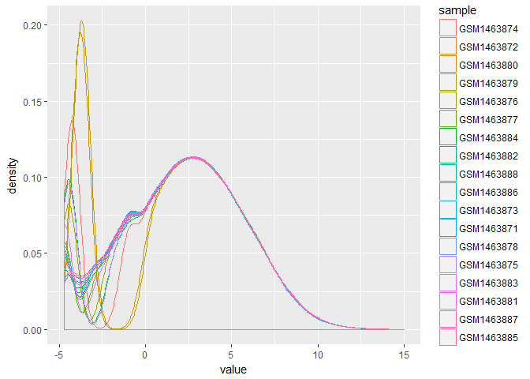

From the plots, we can see that sample GSM1463880 and GSM1463879 are different from the rest in terms of distribution of expression values.

Q2.2 correlation between samples

``` r
sampleMetaData_df <- data.frame(sampleMetaData[-1], row.names = sampleMetaData$sample)

#creating a correlation matrix of data matrix between samples
corData <- cor(logExpressionMatrix)

my_heatmap_obj = pheatmap(corData, cluster_rows = TRUE, scale="none", clustering_method="average", clustering_distance_cols = "correlation", show_rownames=FALSE, annotation=sampleMetaData_df[,c("cell_type","organism_part", "age","batch")])
```

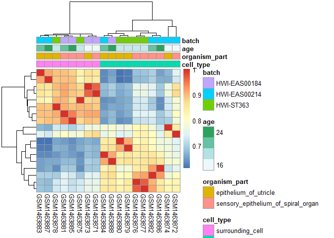

It looks that Cell\_type is most correlated with clusters in gene expression data because there is a clear distinction in gene expression as cell\_type varies from one type to another. GSM1463875 correlates with the samples of the different cell\_type just as well as with the samples of the same cell\_type.

PCA
---

3.1. Perform PCA to summarize the samples

Perform PCA on samples

``` r
data_pca <- data.frame(data.matrix(expressionMatrix[,-1]), row.names = expressionMatrix$gene)

#scale the data
sprDat_pca <- t(scale(t(data_pca)))

svd_pca<- svd(sprDat_pca)
```

creating bar graph showing the amount of variance explained by each PC.

``` r
barplot(svd_pca$d, ylab="variances", main = "amount of variance explained by PC")
```

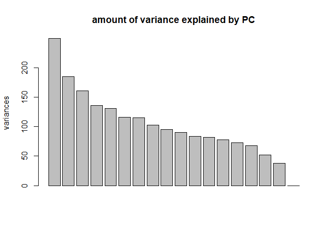

3.2. Confirm that cell\_type is the biggest contributor to variation.

We do this by first plot a scatterplot of cell\_type with regards to up to 10 PCs.

``` r
prinComp <- cbind(sampleMetaData_df, svd_pca$v)

plot(prinComp[, c("cell_type", 1:10)], pch = 19, cex = 0.8)
```

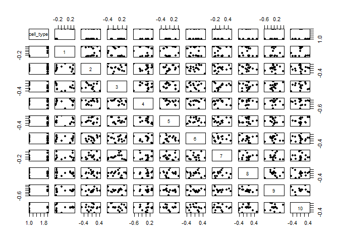

By examining the scatter plot, we can see only PC1 is largely correlated with cell\_type variable. Because low PC1 values correspond to one cell type whereas high PC1 value represents another cell type. All other PCs do not show this clear distinction of cell\_types by PC values.

We then do quantitative assessment of association of the cell\_type variable with all PCs. We do this by fit a linear model to PC values with respect to cell type.

``` r
#change cell type to a numeric vector
celltype <- as.numeric(prinComp[,c("cell_type")])

#initialize RSquare
RSquare<- c(rep(0,10))

#setting plots configuration to 4 plots in a row
par(mfrow=c(1,4))

#iterative do lm on all PC to celltype, extract r squared value from each summary and save it in the RSquare variable
for(i in 1:10){
  PC_random <- prinComp[,c(5+i)]
  lm_random = lm(PC_random ~ celltype)
  RSquare[i] <- summary(lm_random)$r.squared
  plot(PC_random~celltype, col=(celltype) + 1,xaxt="n", 
       ylab=paste0("PC",i));axis(1, at=c(1:2),                                  labels=c("surrounding_cell","sensory_hair_cell"))
  lines(lm_random$fitted ~ celltype, type="b", pch=15, col="black")
}
```

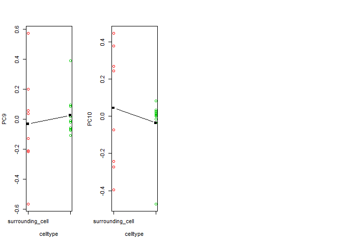

Creating a bar plot showing R-Squared for each PCs

``` r
#bar plot of Cell Types vs each PCs.
barplot(RSquare, xlab="PCs", ylab="Cell Type")
```

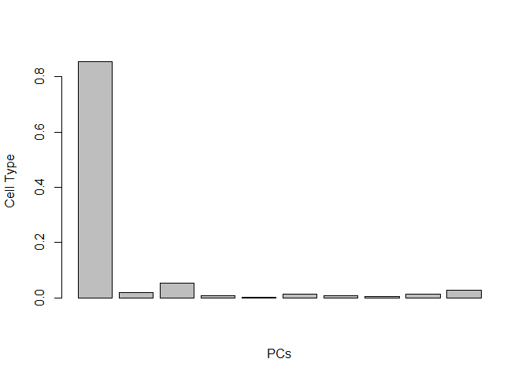

PC1 captures 85% variance due to cell\_type. It confirms our suspicion that cell\_type is the biggest contributor to variance.

3.3 Characterizing Batch Effects

Now we assess the association of the batch variable to all PCs up to PC10. Use the same process as done from last section, just change variable cell\_type to batch.

``` r
#setting batch to a numeric vector
batch <- as.numeric(prinComp[,c("batch")])

#initialize RsQUARE for Batch variable
RSquareB<- c(rep(0,10))

#same logic as in cell type, just change everything to batch
par(mfrow=c(1,4))
for(j in 1:10){
  PC_random <- prinComp[,c(5+j)]
  lm_random = lm(PC_random ~ batch)
  RSquareB[j] <- summary(lm_random)$r.squared
  plot(PC_random~batch, col=(batch) + 1,xaxt="n", 
       ylab=paste0("PC",j));axis(1, at=c(1:3), 
                                 labels=c("HWI-EAS00184", "HWI-EAS00214","HWI-ST363"))
  lines(lm_random$fitted ~ batch, type="b", pch=15, col="black")
  
}
```

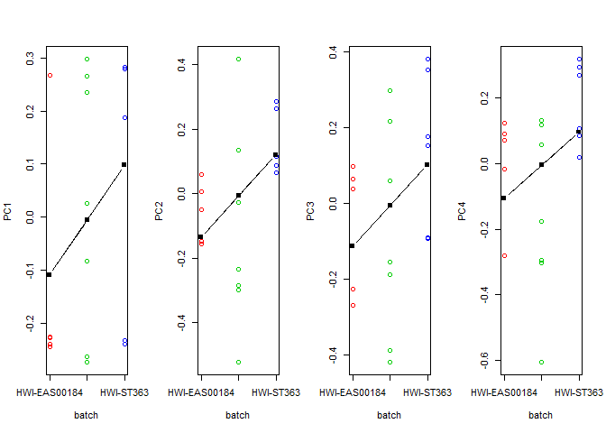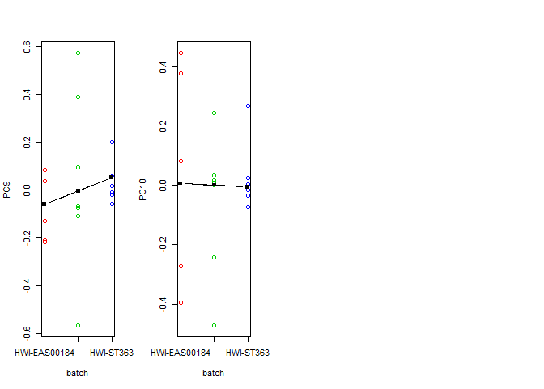

Bar plot of R-squared for each PC for batch variable

``` r
barplot(RSquareB, xlab="PCs", ylab = "R Squared")
```

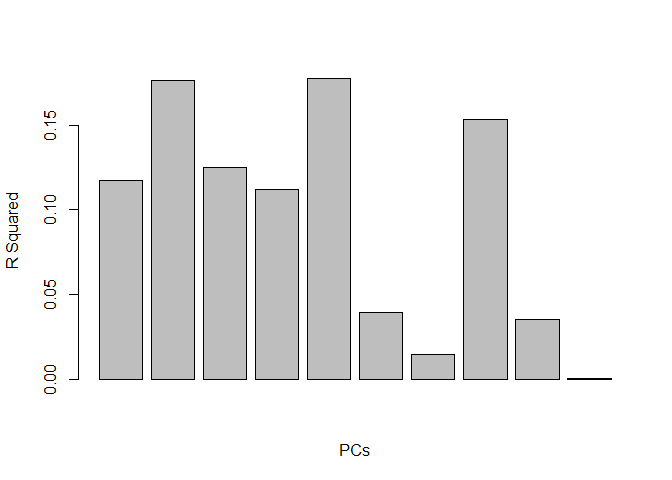

PC2 captures 18% variation and PC1 captures 12% variations due to batch effect.

Conducting differential expression analysis
-------------------------------------------

4.1 Remove lowly expressed genes

First, we are to remove lowly expressed genes. We do this by keeping genes that have CPM &gt;1 in at least as many samples as the smallest group size. First we can compare the sample sizes of each treatment group. The table shows number of genes to be filtered out and number of genes remained.

``` r
finding_smallest_sample_num <- table(sampleMetaData_df$cell_type, sampleMetaData_df$organism_part)

smallest_group_size <- min(finding_smallest_sample_num)
  
clean_expression_data <- expressionMatrix[rowSums(expressionMatrix >1) >= smallest_group_size,]

 keep <-rowSums(expressionMatrix > 1) >= smallest_group_size

 table(keep)
```

    ## keep
    ## FALSE  TRUE 
    ##  1293 13186

``` r
clean_expression_data<-data.frame(as.matrix(clean_expression_data[,-1]), row.names = as.matrix(clean_expression_data[,1]))
```

there are 13186 genes left after cleaning.

4.2 Construct Linear Model

Use limma-voom to fit a linear model with cell type, organism part, age and the interaction between age and cell type as covariates.

4.3 Interpret model

For the gene Eva1a, the value of the coefficient of age is

``` r
coef_eva1a <- lmFitEb$coefficients[which(rownames(lmFitEb$coefficients)=="Eva1a"),c("age")]

coef_eva1a
```

    ## [1] -0.162642

What does the coefficient mean? For a linear model, Y=aX+b, the coefficient of age is a in the linear equation. It represents the slope of the linear regression.

Write down an equation describing the linear model you specified in 4.2. Hint: your equation should have a term for each column of the design matrix. Y = B0 + B1X1 + B2X2 + B3X3 + B4(X1X3), where X1 is cell type, X2 is organism part, X3 is age.

When you create a linear model, the underlying assumptions you are making about the distribution of the data is *The residuals of the fitted model are normally distributed*.

Evaluating the results
----------------------

number of genes differentially expressed by cell types is:

``` r
topGenCellType <- topTable(lmFitEb,coef =  which(colnames(coef(lmFitEb))=="cell_typesensory_hair_cell"),number=nrow(clean_expression_data),p.value = 0.05,  adjust.method = "fdr", lfc = 0)

nrow(topGenCellType)
```

    ## [1] 7

The number of false discovered genes can be calculated by using E(FDR\*R), where R is the total number of discoveries.

``` r
mean(topGenCellType$adj.P.Val) * nrow(topGenCellType)
```

    ## [1] 0.3232449

quantify the number of genes that increase, decrease or don't change by cell type, organism part and age

number of genes that are increased, decreased and do not change by cell type, respectively.

``` r
Trend <- summary(decideTests(lmFitEb,method = "separate", adjust.method = "fdr",p.value= 0.05)) %>% kable()

Trend
```

|        |  (Intercept)|  cell\_typesensory\_hair\_cell|  organism\_partsensory\_epithelium\_of\_spiral\_organ|    age|  cell\_typesensory\_hair\_cell:age|
|--------|------------:|------------------------------:|-----------------------------------------------------:|------:|----------------------------------:|
| Down   |          123|                              4|                                                   138|    135|                                 19|
| NotSig |         7149|                          13179|                                                 12939|  12846|                              13150|
| Up     |         5914|                              3|                                                   109|    205|                                 17|

age variable is associated with the largest number of differentially expressed genes.

5.2. Effect of Age

Take the top 50 genes differentially expressed by age and create a heatmap of their expression levels in logCPM. Sort the genes by p-values and group the samples by time point.

``` r
topGenAge <- topTable(lmFitEb,coef=which(colnames(coef(lmFitEb))=="age"),number=50,p.value = 0.05,  adjust.method = "fdr")

timepointMeta <- as.data.frame(sampleMetaData_df[,c("time_point")], row.names = rownames(sampleMetaData_df)) %>% rownames_to_column()

names(timepointMeta) <- c( "sample", "time_point")

timepointMeta <- ddply(timepointMeta,c("sample","time_point")) %>% column_to_rownames("sample")


heatmapData <- logTransformedCleanData$E[rownames(topGenAge),]

heatmapData <-t(scale(t(heatmapData)))

heatmapData <- as.data.frame(heatmapData[,rownames(timepointMeta)])


pheatmap(heatmapData, cluster_rows = FALSE, cluster_cols = FALSE, scale = "none",
    show_colnames = T, show_rownames = FALSE, 
    main = "Clustering heatmap for Top 50 genes by Age", annotation = timepointMeta[1])
```

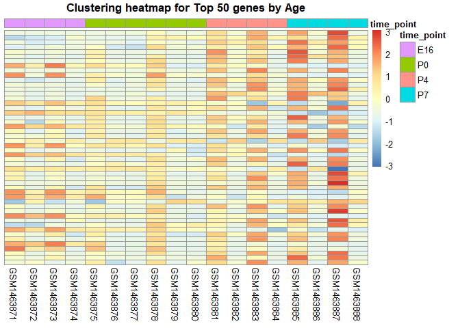

5.3. Interpret the interaction term

Explain what you are modeling with this interaction term. For a particular gene, what does a signifcant interaction term mean?

We are modeling the interaction between cell type and age. That is, for a particular gene, we want to see if the gene expression across age changes by cell type. Significant interaction indicates oppossing gene expression profiles for different cell types across age. i.e. the gene increases expression across age in one cell type, while decrease its expression in another.

For how many probes is the interaction effect significant (FDR less than 0.05)?

``` r
topGenCellType_Age <- topTable(lmFitEb,coef=which(colnames(coef(lmFitEb))=="cell_typesensory_hair_cell:age"),number=nrow(clean_expression_data),p.value = 0.05,  adjust.method = "fdr")

nrow(topGenCellType_Age)
```

    ## [1] 36

5.4.Plot three genes where the interaction does matter

Plot the top three genes with the most significant interaction term. Make a scatterplot with log CPM on the y-axis and age on the x-axis. The shape of each point should correspond to the organism part, and the cell type should correspond to the colour

``` r
genexpr_topInteractionGenes <- logTransformedCleanData$E[rownames(topGenCellType_Age)[1:3],]

genexpr_topInteractionGenes<- as.data.frame(t(genexpr_topInteractionGenes))
genexpr_topInteractionGenes<- rownames_to_column(genexpr_topInteractionGenes)
names(genexpr_topInteractionGenes)[1] <- c("sample")
scatData_topInteractionGenes <- left_join(smeta,genexpr_topInteractionGenes)
```

    ## Joining, by = "sample"

``` r
xage_tg <- scatData_topInteractionGenes$age
yexpr_Gm525 <- scatData_topInteractionGenes[,c("Gm525")]
yexpr_hist <- scatData_topInteractionGenes[,c("Hist2h2aa2")]
yexpr_lrp8 <- scatData_topInteractionGenes[,c("Lrp8")]

ggplot(scatData_topInteractionGenes, aes(x=xage_tg, y=yexpr_Gm525,color=scatData_topInteractionGenes$cell_type, shape=scatData_topInteractionGenes$organism_part )) + geom_point()
```


``` r
ggplot(scatData_topInteractionGenes, aes(x=xage_tg, y=yexpr_hist,color=scatData_topInteractionGenes$cell_type, shape=scatData_topInteractionGenes$organism_part )) + geom_point()
```


``` r
ggplot(scatData_topInteractionGenes, aes(x=xage_tg, y=yexpr_lrp8,color=scatData_topInteractionGenes$cell_type, shape=scatData_topInteractionGenes$organism_part )) + geom_point()
```

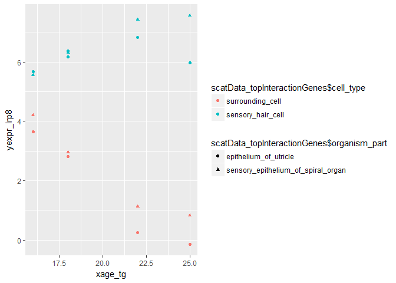

*Bonus*

Compare your results to those obtained by Scheffer et al (2015). Discuss any discrepancies. List at least three explanations for these discrepancies.

Top genes from our analysis and the paper is different. This could be due to the following reasons:

The way we do FDR is different. In the paper,they selected 916 genes by choosing those enriched 4× with FDR &lt; 0.05 in postnatal (P0, P4, and P7) cochlear HCs compared with postnatal cochlear SCs, or enriched in postnatal utricular HCs with the same criteria., whereas in our assignment, we choose FDR &lt; 0.05 in four stages.

Voom prefers count data, however, we passed CPM values to it. This might change the results.

The paper did not discuss how they did the filtering step, but I suspect it might be different than ours. Different filtering can result in discrepancies.
