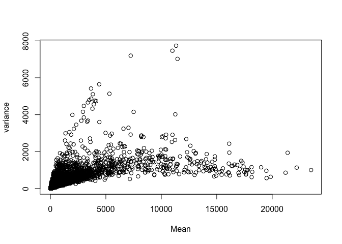

Data Inspection and Basic Manipulation
--------------------------------------

We first look at some basic information from our data. The data we used are from the published paper Pellagatti (2006). It is mircroarray data.

number of genes

    ## [1] 54675

number of samples

    ## [1] 66

the metadata contains factors:

    ## [1] "genotype"  "karyotype"

number of levels in each factor:

    ## [1] "normal" "RA"     "RAEB1"  "RARS"   "RAEB2"

    ## [1] "normal"  "del(5q)" "other"

1.2. Data manipulation

We add two other column to the meta, which represents normal and MDS groups, another column represents low risk and high risk and control. It will help us compare different group easily in the subsequent analysis.

``` r
type = gse_meta$genotype
type = gsub("RA","MDS",type)
type = gsub("RS","",type)
type = gsub("EB1","",type)
type = gsub("EB2","", type)
gse_meta = add_column(gse_meta,type)
```

``` r
gse_meta$type<- gse_meta$type %>% factor(levels = c("normal","MDS"))

gse_meta <- mutate(gse_meta, prognosis = ifelse(test = genotype == "RA", yes = "low_risk", no = ifelse(
  test = genotype == "RARS", yes = "low_risk", no = ifelse(
    test = genotype == "RAEB1", yes = "high_risk", no = ifelse(
      test = genotype == "RAEB2", yes = "high_risk", no = ifelse(
      test = genotype == "normal", yes = "control", no = ""))))))
head(gse_meta)
```

    ##   sample_id genotype karyotype   type prognosis
    ## 1 GSM103343   normal    normal normal   control
    ## 2 GSM103344   normal    normal normal   control
    ## 3 GSM103345   normal    normal normal   control
    ## 4 GSM103346    RAEB1   del(5q)    MDS high_risk
    ## 5 GSM103347       RA   del(5q)    MDS  low_risk
    ## 6 GSM103348     RARS   del(5q)    MDS  low_risk

1.3. Gene graphing

Sainity check: According to the paper,IFIM1,IFIT1,IFIT4 genes are up-regulated in the MDS group. We can plot expression for one of genes and test this.
=======================================================================================================================================================

    ## Warning in grep(IFIT4_probe, gse_data$gene): argument 'pattern' has length
    ## > 1 and only the first element will be used

    ## Joining, by = "sample_id"
    ## Joining, by = "sample_id"
    ## Joining, by = "sample_id"


The plot shows the normal and MDS group expression for the IFIM1 gene. The plot confirms the finding of the study.

Assessing Overall Data Quality
------------------------------

2.1. Normalization

To test the assumption for linear model, we need to see if data is normally distributed.

``` r
probe_means = rowMeans(gse_data[,-1])
probe_vars = apply(gse_data[,-1],1,sd)
plot(probe_vars~probe_means, xlab="Mean", ylab="variance")
```



This does not look symmetrical, we can use log2 transform the data.

``` r
gse_data_log = as.data.frame(log2(gse_data[,-1]),row.names = gse_data[,1])
probe_means = rowMeans(gse_data_log)
probe_vars = apply(gse_data_log,1,sd)
plot(probe_vars~probe_means, xlab="Mean", ylab="variance")
```


Comparing this to our previous plot. It lookS more normal. For the subsequent analysis, we will use log transformed data to fit linear models.

2.2. Overall Distribution

Distribution of gene expresison across samples shown through box plot and density plot.

    ## No id variables; using all as measure variables


There seems to have two populations that show differential expressions. We suspect the two populations are healthy and MDS groups. We can explore this further with heatmaps.

We filter the cells into low risk and control, high risk and control, and low risk and high risk.

``` r
# filtering control cells and low risk
LowRisk_Samples <- gse_meta %>%
  filter(genotype =="normal" | genotype =="RA" | genotype =="RARS")
# filtering control cells and high risk
HighRisk_Samples <- gse_meta %>%
  filter(genotype =="normal" | genotype == "RAEB1" | genotype == "RAEB2")
#filtering low risk and high risk cells
lowHigh_Samples <- gse_meta %>% 
  filter(prognosis %in% c("low_risk", "high_risk"))

#function to extract gene expression data based on sample id
# getExpressionForSamples <- function(sampleIds, expressionMatrix){
#   dataFrame <- expressionMatrix %>%
#     as.data.frame() %>%
#     column_to_rownames("gene")
#   
#   return(dataFrame[sampleIds])
# }

#lowrisk and control expression data
#LowRisk_ExpressionMatrix <- getExpressionForSamples(LowRisk_Samples$sample_id,gse_data_log)
LowRisk_ExpressionMatrix <- gse_data_log[LowRisk_Samples$sample_id]
#HighRisk and control expression data
#HighRisk_ExpressionMatrix <- getExpressionForSamples(HighRisk_Samples$sample_id,gse_data_log)
HighRisk_ExpressionMatrix <- gse_data_log[HighRisk_Samples$sample_id]

# Low risk and High risk expression data
lowHigh_ExpressionMatrix <- gse_data_log[lowHigh_Samples$sample_id]
```
