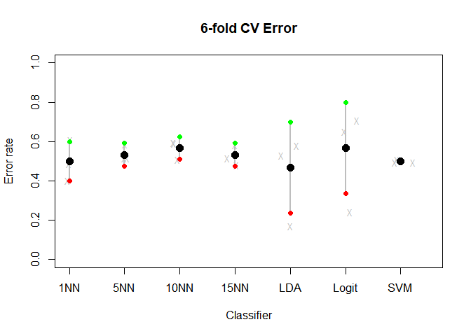
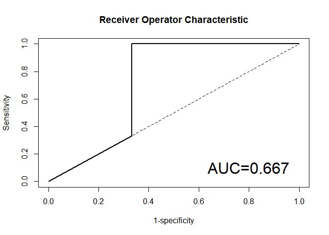
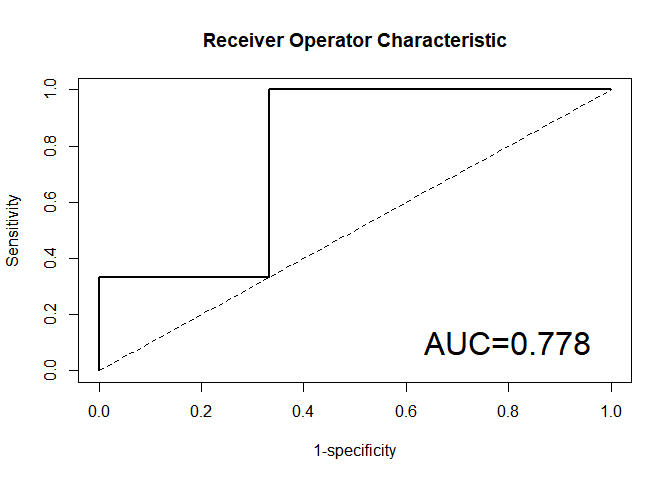
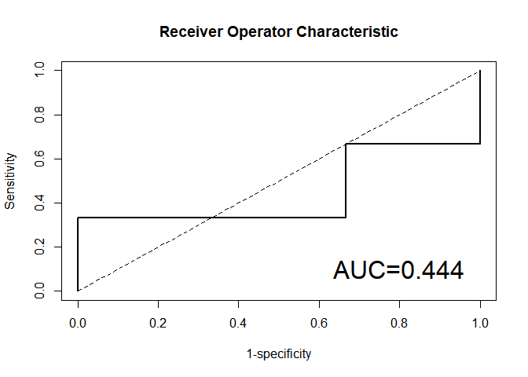
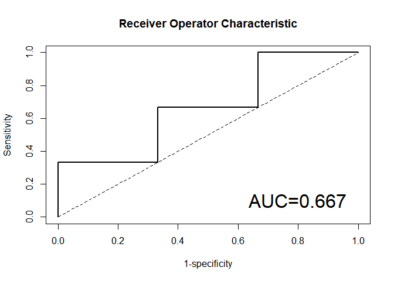

predictionModel
================

R Markdown
----------

``` r
load("GSE4619.Rdata")

type =gse_meta$genotype
type = gsub("RA","MDS",type)
type = gsub("RS","",type)
type = gsub("EB1","",type)
type = gsub("EB2","", type)
gse_meta = add_column(gse_meta,type)

gse_meta$type<- gse_meta$type %>% factor(levels = c("normal","MDS"))

gse_meta <- mutate(gse_meta, prognosis = ifelse(test = genotype == "RA", yes = "low risk", no = ifelse(
  test = genotype == "RARS", yes = "low risk", no = ifelse(
    test = genotype == "RAEB1", yes = "high risk", no = ifelse(
      test = genotype == "RAEB2", yes = "high risk", no = ifelse(
        test = genotype == "normal", yes = "control", no = ""))))))


head(gse_meta)
```

    ##   sample_id genotype karyotype   type prognosis
    ## 1 GSM103343   normal    normal normal   control
    ## 2 GSM103344   normal    normal normal   control
    ## 3 GSM103345   normal    normal normal   control
    ## 4 GSM103346    RAEB1   del(5q)    MDS high risk
    ## 5 GSM103347       RA   del(5q)    MDS  low risk
    ## 6 GSM103348     RARS   del(5q)    MDS  low risk

Data Preparation

We are interested in predicting if a patient is low risk or high risk. Our data contains 66 samples. 37 low risk and 18 high risk. We will use 15 low risk and 15 high risk as training data, and 3 high risk and 3 low risk as test sets.

``` r
v_ls <- which(gse_meta[,c("prognosis")]=="low risk")
v_hs <- which(gse_meta[,c("prognosis")]=="high risk")

v_ls_training <- sample(v_ls, 15)
v_hs_training <- sample(v_hs, 15)

v_ls_test <- sample(setdiff(v_ls,v_ls_training), 3)
v_hs_test <- setdiff(v_hs, v_hs_training)

Status <- vector(length = 66)

Status[v_ls_training]<-"training"
Status[v_hs_training] <-"training"
Status[v_ls_test] <- "test"
Status[v_hs_test] <-"test"

gse_meta <- add_column(gse_meta, Status)

gse_meta <- gse_meta[-which(gse_meta[,c("Status")]=="FALSE"),]

gse_meta$prognosis <- gse_meta$prognosis %>% factor(levels = c("low risk","high risk")) 

gse_meta$Status <- gse_meta$Status %>% factor(levels=c("training", "test"))

gse_meta_training <- gse_meta[which(gse_meta$Status=="training"),]

gse_meta_test <- gse_meta[which(gse_meta$Status=="test"),]

# sampleID_training <- gse_meta$sample_id[which(gse_meta$Status=="training")]
# 
# sampleID_test <- gse_meta$sample_id[which(gse_meta$Status=="test")]

getExpressionForSamples <- function(sampleIds, expressionMatrix) {
  # use gene column as row name
  dataFrame <- expressionMatrix %>% 
    as.data.frame() %>% 
    column_to_rownames("gene")
  # use give sampleIds to pull out the subset of interest (ORDERING OF SAMPLES IS VERY IMPORTANT)
  return(dataFrame[sampleIds])
}

trainDat <- getExpressionForSamples(gse_meta_training$sample_id,gse_data)
testDat <- getExpressionForSamples(gse_meta_test$sample_id,gse_data)
Dat <- getExpressionForSamples(gse_meta$sample_id,gse_data)
```

Cross-Validation and loop of feature selection and modeling

``` r
nfold = 3

tabTrain <- table(gse_meta_training$prognosis)

indlist <- sapply(names(tabTrain), function(z) which(gse_meta_training$prognosis == z), simplify = FALSE)

set.seed(1234)

fold.low <- matrix(sample(indlist[["low risk"]]), nrow= nfold)
fold.high <- matrix(sample(indlist[["high risk"]]), nrow= nfold)
# 
# ```
# 
# Loop for feature selection and modeling
# 
# ```{r lf}

ngenes <- 50

nmethod <- 7

pr.err <- matrix(-1, nfold,nmethod, dimnames=list(paste0("Fold",1:nfold),c("1NN","5NN","10NN", "15NN","LDA","Logit","SVM")))

for(i in 1:nfold){
  
  #Test Fold for the i-th step
  testdat.fold<-trainDat[,c(fold.low[i,],fold.high[i,])]
  #I will create a factor of classes for the test set of the i_th fold
  testclass.fold<-gse_meta_training$prognosis[c(fold.low[i,],fold.high[i,])]
  
  
  #The rest of the samples are the training set for the i-th step
  traindat.fold<-trainDat[,-c(fold.low[i,],fold.high[i,])]
  trainclass.fold<-gse_meta_training$prognosis[-c(fold.low[i,],fold.high[i,])]
  
  #Step 1: feature selection (do you remember limma?). 
  
  # Note that a different set of genes will be selected for each fold! you can then compare how consistent these sets were.
  
  limma.dat<-as.data.frame(traindat.fold)
  desMat <- model.matrix(~ trainclass.fold, limma.dat) #design matrix
  trainFit <- lmFit(limma.dat, desMat)
  eBtrainFit <- eBayes(trainFit)
  
  # top-50 limma genes
  top.fold <- topTable(eBtrainFit, coef = which(colnames(coef(trainFit)) != "(Intercept)"),
                       n = ngenes,sort.by="P")
  
  #Retain the top-50 limma genes from the train and test sets
  traindat.fold <- traindat.fold[rownames(top.fold),]
  testdat.fold <-  testdat.fold[rownames(top.fold),]
  
  
  #STEP 2: select a classifier
  #Set a counter for the method tested
  l <- 0
  
  #kNN classifiers
  for(kk in c(1,5,10,15)) {
    #every time you get inside this loop, the l counter gets redefined (i.e., 1, 2, etc for         method 1, method 2, etc)
    l <- l+1
    
    #knn needs samples in rows
    yhat.knn <- knn(train=t(traindat.fold), test=t(testdat.fold), cl=trainclass.fold,
                    k = kk)
    #Store the prediction error for each kk within this fold
    pr.err[i,l]<- mean(testclass.fold != yhat.knn)
  } #end of kNN loop
  
  #LDA method. Note that you can change the prior parameter to reflect a different proportion of case and control samples. The default is to use the class proportions from the training set.
  
  m.lda <- lda(x=t(traindat.fold), group=trainclass.fold, prior=c(.5, .5))
  yhat.lda <- predict(m.lda, newdata=t(testdat.fold))$class
  pr.err[i,"LDA"] <-mean(testclass.fold != yhat.lda)
  
  #Logit
  glm.dat <- data.frame(t(traindat.fold), group=trainclass.fold)
  
  # 50 factors still will cause optimization warnings  
  # Try without warning suppression to see 
  # To further reduce parameters, regularized regression can be used 
  # To use regularized regression uncomment lines followed by "uncomment for regularized regression" 
  suppressWarnings( m.log <- glm(group ~ ., data=glm.dat,family=binomial) ) 
  
  # uncomment for regularized regression 
  # m.log <- glmnet( t(traindat.fold) , trainclass.fold ,family="binomial") 
  
  pr.log <- predict(m.log,newdata=data.frame(t(testdat.fold)),type="response")
  
  # uncomment for regularized regression 
  # pr.log <- predict(m.log,newdata=data.frame(t(testdat.fold)),type="response",newx=t(testdat.fold)) 
  
  pr.cl <- rep(0,length(testclass.fold))
  pr.cl[pr.log > 1/2] <- "high risk"
  pr.cl[pr.log <= 1/2] <- "low risk"
  
  pr.cl <- factor(pr.cl)
  pr.err[i,"Logit"] <- mean( pr.cl != testclass.fold )
  
  #SVM
  m.svm <- svm(x=t(traindat.fold), y=trainclass.fold, cost=1, type="C-classification", 
               kernel="linear")
  pr.svm <- predict(m.svm,newdata=t(testdat.fold)) 
  
  pr.err[i,"SVM"] <- mean( pr.svm != testclass.fold )
} #end of CV loop
```

    ## Warning in lda.default(x, grouping, ...): variables are collinear

    ## Warning in predict.lm(object, newdata, se.fit, scale = 1, type =
    ## ifelse(type == : prediction from a rank-deficient fit may be misleading

    ## Warning in lda.default(x, grouping, ...): variables are collinear

    ## Warning in predict.lm(object, newdata, se.fit, scale = 1, type =
    ## ifelse(type == : prediction from a rank-deficient fit may be misleading

    ## Warning in lda.default(x, grouping, ...): variables are collinear

    ## Warning in predict.lm(object, newdata, se.fit, scale = 1, type =
    ## ifelse(type == : prediction from a rank-deficient fit may be misleading

Error Rate

``` r
cv.err <- colMeans(pr.err)

# mean - 1 sd (sd of the 6 error rates)
ls <- cv.err - apply(pr.err, 2, sd)

# mean + 1 sd (sd of the 6 error rates)
us <- cv.err + apply(pr.err, 2, sd)

# plot the results
plot(1:nmethod, cv.err, ylim=c(0, 1), xlim=c(1, (nmethod+.5)),type='n', 
     axes=FALSE, xlab='Classifier', ylab='Error rate',main="6-fold CV Error")

for(j in 1:ncol(pr.err)) 
  points(jitter(rep(j, 3), factor=2), jitter(pr.err[,j]), cex=0.8, pch='X', col='gray')

for(i in 1:nmethod)
  lines(c(i, i), c(ls[i], us[i]), lwd=2, col='gray')
points(1:nmethod, ls, pch=19, col='red')
points(1:nmethod, us, pch=19, col='green')
points(1:nmethod, cv.err, pch=19, cex=1.5, col='black')
axis(2, ylab='Error rate')
axis(1, 1:nmethod, colnames(pr.err))

box()
```



Test selected model

10NN is the model we are going to use to classify samples in the test set, we need to train the model using the FULL training set and then classify samples of the test set.

``` r
yhat.knn <- knn(train=t(trainDat), test=t(testDat), cl=gse_meta_training$prognosis,
                k = 10)
#Store the prediction error for each kk within this fold
pr.errTest<- mean(gse_meta_test$prognosis != yhat.knn)

pr.errTest
```

    ## [1] 0.5

The error rate indicated how often the prediction matched the actual prognosis status, either low risk or high risk, against the total number of cases.

Next, We used AUC as a criteria to select a model based on the training data. Methods to be tested are pknnCMA, plrCMA, ldaCMA and svmCMA.

AUC for 5NN

``` r
splits <- GenerateLearningsets(y = gse_meta_training$prognosis, method="CV", fold=3, strat= TRUE)

featureScores<-GeneSelection(X=t(trainDat), y=gse_meta_training$prognosis, learningsets=splits, method="limma")
```

    ## GeneSelection: iteration 1 
    ## GeneSelection: iteration 2 
    ## GeneSelection: iteration 3

``` r
toplist(featureScores)
```

    ## top  10  genes for iteration  1 
    ##  
    ##    index importance
    ## 1  33720   31.01418
    ## 2  18179   30.89575
    ## 3  38319   30.17241
    ## 4  47938   29.39822
    ## 5  10527   28.40016
    ## 6  17556   26.75657
    ## 7  28446   25.26901
    ## 8  27098   24.41172
    ## 9  49497   23.37385
    ## 10 37354   22.36501

``` r
seliter<-numeric()
for(i in 1:nfold) seliter<-c(seliter, toplist(featureScores, iter=i, top = 10, show=FALSE)$index)
(sort(table(seliter), dec=T)) 
```

    ## seliter
    ##  3719 10407 10527 11848 13365 14751 15185 17556 18179 20539 21477 23007 
    ##     1     1     1     1     1     1     1     1     1     1     1     1 
    ## 27098 27244 27377 28446 29034 33720 35631 36612 36885 37354 37506 37982 
    ##     1     1     1     1     1     1     1     1     1     1     1     1 
    ## 38319 44829 47938 49497 53677 54010 
    ##     1     1     1     1     1     1

``` r
bestprobes<-as.numeric(names(sort(table(seliter), dec=T)))[1:20]


m<-matrix(which(gse_meta$Status=="training"), 1)

full.learningset<-new("learningsets", learnmatrix=m, method="my own", ntrain=30, iter=1)

fullFeatureScores<-GeneSelection(X=t(Dat), learningsets= full.learningset, y=gse_meta$prognosis, method="t.test") 
```

    ## GeneSelection: iteration 1

``` r
testclassif<-classification(X=t(Dat), y=gse_meta$prognosis, learningsets= full.learningset, genesel=fullFeatureScores, nbgene = 20, classifier =pknnCMA, k=5)
```

    ## iteration 1

``` r
tres<-testclassif[[1]]

ftable(tres)
```

    ## number of missclassifications:  1 
    ## missclassification rate:  0.167 
    ## sensitivity: 1 
    ## specificity: 0.667 
    ##     predicted
    ## true 0 1
    ##    0 2 1
    ##    1 0 3

``` r
print(roc(tres))
```



    ##       auc 
    ## 0.6666667

AUC for 10NN.

``` r
testclassif<-classification(X=t(Dat), y=gse_meta$prognosis, learningsets= full.learningset, genesel=fullFeatureScores, nbgene = 20, classifier =pknnCMA, k=10)
```

    ## iteration 1

``` r
tres<-testclassif[[1]]

ftable(tres)
```

    ## number of missclassifications:  2 
    ## missclassification rate:  0.333 
    ## sensitivity: 1 
    ## specificity: 0.333 
    ##     predicted
    ## true 0 1
    ##    0 1 2
    ##    1 0 3

``` r
roc(tres)
```



AUC FOR 15NN

``` r
testclassif<-classification(X=t(Dat), y=gse_meta$prognosis, learningsets= full.learningset, genesel=fullFeatureScores, nbgene = 20, classifier =pknnCMA, k=15)
```

    ## iteration 1

``` r
tres<-testclassif[[1]]

ftable(tres)
```

    ## number of missclassifications:  2 
    ## missclassification rate:  0.333 
    ## sensitivity: 0.333 
    ## specificity: 1 
    ##     predicted
    ## true 0 1
    ##    0 3 0
    ##    1 2 1

``` r
roc(tres)
```



AUC for method plrCMA.

``` r
testclassif<-classification(X=t(Dat), y=gse_meta$prognosis, learningsets= full.learningset, genesel=fullFeatureScores, nbgene = 100, classifier =plrCMA)
```

    ## iteration 1

``` r
tres<-testclassif[[1]]

ftable(tres)
```

    ## number of missclassifications:  3 
    ## missclassification rate:  0.5 
    ## sensitivity: 0.333 
    ## specificity: 0.667 
    ##     predicted
    ## true 0 1
    ##    0 2 1
    ##    1 2 1

``` r
roc(tres)
```



AUC for method LDA

``` r
testclassif<-classification(X=t(Dat), y=gse_meta$prognosis, learningsets= full.learningset, genesel=fullFeatureScores, nbgene = 30, classifier =ldaCMA)
```

    ## iteration 1

    ## Warning in lda.default(x, grouping, ...): variables are collinear

``` r
tres<-testclassif[[1]]

ftable(tres)
```

    ## number of missclassifications:  4 
    ## missclassification rate:  0.667 
    ## sensitivity: 0.333 
    ## specificity: 0.333 
    ##     predicted
    ## true 0 1
    ##    0 1 2
    ##    1 2 1

``` r
roc(tres)
```


AUC for method SVM

``` r
testclassif<-classification(X=t(Dat), y=gse_meta$prognosis, learningsets= full.learningset, genesel=fullFeatureScores, nbgene = 20, classifier =svmCMA)
```

    ## iteration 1

``` r
tres<-testclassif[[1]]

ftable(tres)
```

    ## number of missclassifications:  4 
    ## missclassification rate:  0.667 
    ## sensitivity: 0.333 
    ## specificity: 0.333 
    ##     predicted
    ## true 0 1
    ##    0 1 2
    ##    1 2 1

``` r
# print(compare(list(testclassif), measure="auc", plot=FALSE))
```

Overall, in our project, we use cross-validation on the training dataset to evaluate different parameters and classifiers, and only evaluated the generalizability of the best model on the test set. We also used AUC to select the best model.  

Conclusion:
AUC indicated that 10NN is the best model with AUC 0.778. However, the error rate is high, being 0.5. 
There are some areas of improvement with prediction and model selection used above. Because the difference in sample sizes in low risk and high risk samples (37 low risk and 18 high risk), when making the training and testing data sets, we select 18 samples from each group and divide them into training and testing group. For low risk samples, we therefore randomly excluded 19 samples. In future analysis, a method should incorporate those samples into analysis as well. 
